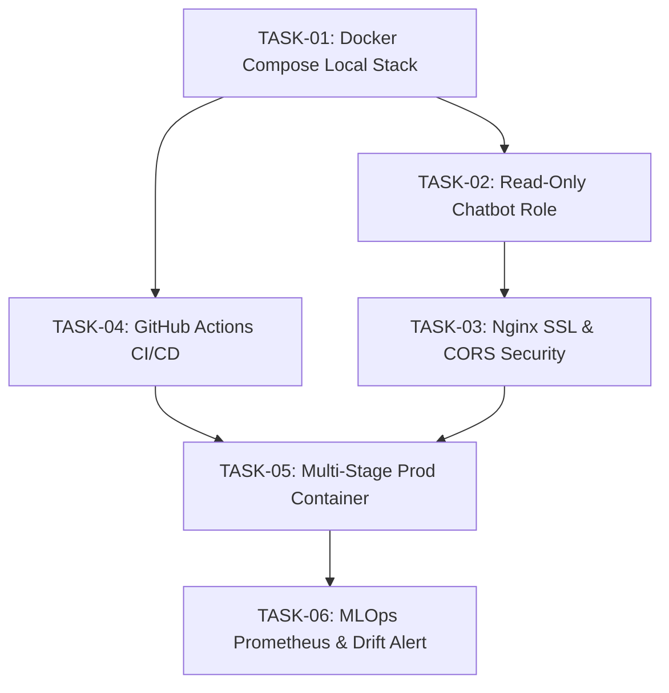

# Infra, MLOps, & DevOps — Dekomposisi Sprint & Task Master Plan

Dokumen ini berisi panduan dan master plan eksekusi tugas teknis terperinci untuk modul **Infrastructure, MLOps, dan DevOps** pada sistem **KIDECO Fuel Ratio Optimization System** (Laravel Web Portal, Vue 3 Frontend, & Python AI Service).

---

## 📌 1. Sprint Overview

Sub-proyek **`infra-mlops-devops/`** bertanggung jawab mengamankan, mengotomatisasi, dan menyediakan infrastruktur yang andal, scalable, serta ter-monitor untuk seluruh ekosistem aplikasi. Sub-proyek ini memastikan konsistensi lingkungan pengembangan lokal hingga produksi, otomatisasi validasi kode (CI/CD), keamanan data berbasis aturan akses ketat, serta pengawasan kesehatan model AI (PyTorch Autoencoder & XGBoost) dari potensi *Data Drift*.

---

## 🎯 2. Sprint Goals & Key Milestones

1. **Dockerization & Environment Harmonization**: Menyediakan arsitektur *multi-container* lokal yang identik dengan lingkungan produksi (PostgreSQL 16, Redis 7, Laravel PHP 8.2, Python 3.11/3.13 AI Service).
2. **Security Hardening & Read-Only Access Control**: Mengeliminasi celah SQL Injection pada AI Chatbot Retrieval dengan user database terpisah (`chatbot_reader`) serta menerapkan kebijakan HTTPS/Nginx SSL & CORS/CSP.
3. **Automated Continuous Integration (CI/CD)**: Membangun pipeline otomatisasi pengujian berbasis GitHub Actions yang menjalankan PHPUnit test suite pada Laravel Portal dan PyTest suite pada Python AI Service.
4. **Production Multi-Stage Build & Deployment**: Meminimalkan ukuran image container dan mengamankan eksekusi aplikasi menggunakan pengguna non-root dalam kontainer produksi multi-stage.
5. **MLOps Model Drift Alerting & Observability**: Mengintegrasikan Prometheus + Grafana untuk melacak latensi inferensi FastAPI (<2.0 detik), statistik deteksi anomali unit, serta mendeteksi *Data Drift* secara otomatis menggunakan Kolmogorov-Smirnov Test.

---

## 📑 3. Task Index Table

| Task ID | Judul / Fokus Utama | Modul | Assignee / Role | Target File Utama |
|:---|:---|:---|:---|:---|
| **TASK-01** | Docker Compose Local Multi-Container Environment | Infrastructure | DevOps Engineer | `docker-compose.yml`, `.env.example` |
| **TASK-02** | Dedicated Read-Only PostgreSQL Role (`chatbot_reader`) | Security / DB | Database Administrator | `init-chatbot-read-only.sql` |
| **TASK-03** | Nginx Reverse Proxy, SSL Termination & CORS/CSP Hardening | Infrastructure / Security | DevOps Engineer | `nginx/conf.d/app.conf`, `security.conf` |
| **TASK-04** | Automated GitHub Actions CI/CD Testing Pipeline | DevOps | CI/CD Engineer | `.github/workflows/ci.yml` |
| **TASK-05** | Production Multi-Stage Containerization & Hardening | Infrastructure | DevOps Engineer | `Dockerfile.laravel`, `Dockerfile.ai` |
| **TASK-06** | MLOps Metrics Scraping, Prometheus, Grafana & Drift Alerting | MLOps | MLOps Engineer | `docker-compose.monitoring.yml`, `prometheus.yml` |

---

## 🔗 4. List of Tasks Reference & Workflow Dependency

1. **TASK-01 (Docker Stack)** menjadi fondasi utama tempat seluruh pengujian lokal, koneksi database PostgreSQL, dan Redis bergantung.
2. **TASK-02 (Read-Only Role)** dijalankan langsung di atas container PostgreSQL untuk mengamankan Chatbot AI Engine dari akses modifikasi data (Celah #2).
3. **TASK-03 (Nginx & Security)** meng-expose Laravel Portal & Python AI Engine di balik Nginx Reverse Proxy dengan TLS/SSL dan CORS restriction.
4. **TASK-04 (CI/CD Pipeline)** secara otomatis mengeksekusi suite pengujian (PHPUnit & PyTest) di setiap Push/PR ke repository branch `main` & `develop`.
5. **TASK-05 (Production Container)** menyusun image produksi yang ringan dan aman untuk siap di-deploy ke server staging/production.
6. **TASK-06 (MLOps & Drift Alerting)** memantau performa inferensi PyTorch Autoencoder & XGBoost Regressor di lingkungan runtime dan memberikan peringatan dini (*alerting*) saat distribusi data bergeser (*data drift*).
