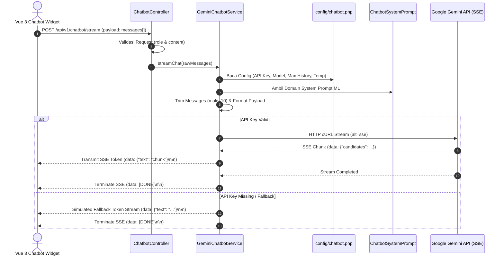

# Gemini AI Chatbot — Analisis Arsitektur & Terpisah Konfigurasi (Decoupled Config)

Dokumen ini berisi analisis teknis mendetail tentang arsitektur integrasi **Gemini AI Chatbot** pada Laravel Web Portal (`laravel/`), yang telah disederhanakan dan dipisahkan (*decoupled*) ke dalam file konfigurasi dan service layer tersendiri.

---

## 🏛️ 1. Alur Arsitektur & Pola Desain (Architectural Flow)

Aplikasi menerapkan pola **Clean Architecture & Single Responsibility Principle (SRP)** di mana Controller hanya bertanggung jawab atas validasi HTTP input, sementara seluruh logika integrasi AI dipisahkan ke Service Layer dan File Konfigurasi Khusus.

---

## ⚙️ 2. Pemisahan File Konfigurasi Khusus (`config/chatbot.php`)

Seluruh parameter teknis AI Chatbot kini diatur secara terpusat di file [config/chatbot.php](file:///d:/Persekutuan-Kewer-Mahasiswa/laravel/config/chatbot.php):

| Key Konfigurasi | Environment Variable | Default Value | Deskripsi Fungsi |
|:---|:---|:---|:---|
| `api_key` | `GEMINI_API_KEY` | `''` | API Key resmi Google Gemini. |
| `model` | `GEMINI_MODEL` | `'gemini-1.5-flash'` | Identitas model LLM Gemini. |
| `base_url` | `GEMINI_BASE_URL` | `'https://generativelanguage...'` | Base URL REST API Google Generative Language. |
| `max_history_length` | `CHATBOT_MAX_HISTORY` | `10` | Batasan riwayat pesan (Stateless Guard). |
| `generation_config.temperature` | `CHATBOT_TEMPERATURE` | `0.4` | Tingkat kreativitas respons (0.0 - 1.0). |
| `generation_config.maxOutputTokens` | `CHATBOT_MAX_TOKENS` | `1500` | Batas maksimum token respons per request. |
| `fallback.enabled` | - | `true` | Mengaktifkan streamer fallback jika API key kosong. |
| `system_prompt_class` | - | `ChatbotSystemPrompt::class` | Class penyuplai pengetahuan domain ML KIDECO. |

---

## 🧱 3. Pembagian Peran Komponen Terpisah

### A. Thin Controller ([ChatbotController.php](file:///d:/Persekutuan-Kewer-Mahasiswa/laravel/app/Http/Controllers/Api/ChatbotController.php))
- **Tugas**: Menangani validasi skema HTTP (`messages.*.role`, `messages.*.content`) dan meneruskan eksekusi ke `GeminiChatbotService`.
- **Ukuran Kode**: Sangat ringkas (< 35 baris).

### B. Service Layer ([GeminiChatbotService.php](file:///d:/Persekutuan-Kewer-Mahasiswa/laravel/app/Services/GeminiChatbotService.php))
- **Tugas**:
  1. Melakukan trimming riwayat pesan secara aman.
  2. Memformat perataan *role* (`user` / `model`).
  3. Mengelola koneksi cURL streaming SSE ke Gemini API.
  4. Menyediakan fallback streaming cerdas jika API Key belum terpasang.

### C. Domain Knowledge Prompt ([ChatbotSystemPrompt.php](file:///d:/Persekutuan-Kewer-Mahasiswa/laravel/app/Services/ChatbotSystemPrompt.php))
- **Tugas**: Menyimpan aturan bisnis Machine Learning (XGBoost forecasting, PyTorch Autoencoder spikes, Rain Derating non-linear, Alert Statuses).

---

## 🔒 4. Jaminan Keamanan & Performa

1. **Stateless & Zero Database Footprint**: Chatbot tidak melakukan operasi I/O basis data PostgreSQL (mencegah beban koneksi database).
2. **Double-Layer History Trimming**: Pemotongan riwayat pesan maksimal 10 item dilakukan di frontend Vue 3 dan dipertegas kembali di `GeminiChatbotService`.
3. **No-Buffer SSE Output**: Mengirimkan header `X-Accel-Buffering: no` dan `Cache-Control: must-revalidate, no-cache, private` agar Nginx / Reverse Proxy langsung menyalurkan token tanpa delay penampungan.
