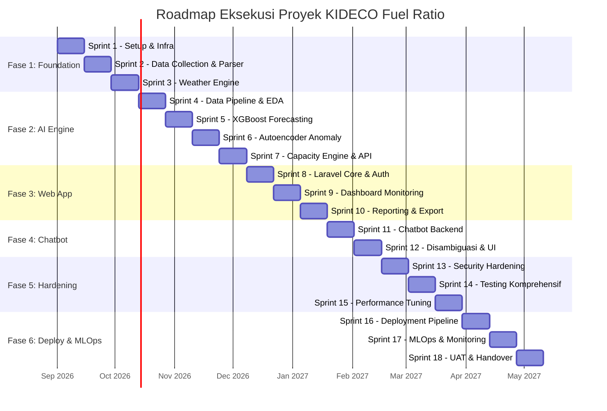
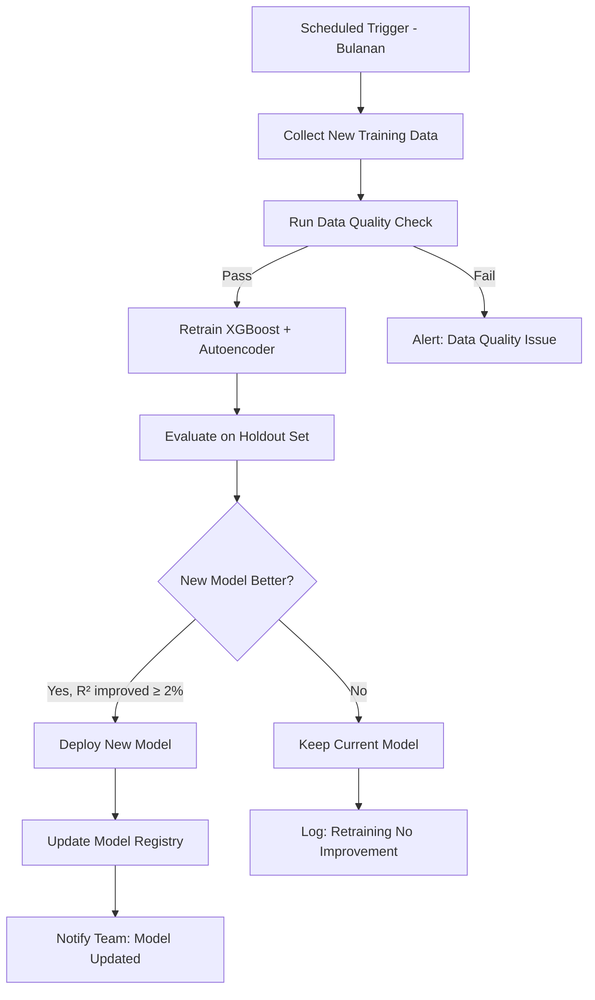

# Implementation Plan — KIDECO Fuel Ratio Integrated System

## Eksekusi Proyek Terdekomposisi: 6 Fase, 18 Sprint

> **Durasi Sprint:** 2 minggu (10 hari kerja)  
> **Total Estimasi:** ~36 minggu (9 bulan)  
> **Metodologi:** Agile Scrum dengan sprint review & retrospective tiap akhir sprint

---

## Peta Fase & Sprint



---

## FASE 1: FOUNDATION & DATA INFRASTRUCTURE
> **Tujuan:** Membangun fondasi proyek, mengumpulkan data riil, dan menyiapkan pipeline ingestion data.  
> **Solusi Celah:** #1 (Data Sintetis), #10 (Excel Parser Fragile), #9 (Formula Derating)

---

### Sprint 1 — Project Setup & Infrastructure (Minggu 1-2)

**Objektif:** Menyiapkan seluruh environment development, repository, dan infrastruktur dasar.

#### Task Breakdown:

| # | Task | Detail | Estimasi | Deliverable |
|:--|:-----|:-------|:---------|:------------|
| 1.1 | Setup Repository Monorepo | Buat Git repository dengan struktur: `laravel-app/`, `python-ai-service/`, `docs/`, `tests/` | 1 hari | Repository dengan branch strategy (main, develop, feature/*) |
| 1.2 | Setup Laravel 11.x Project | `composer create-project laravel/laravel`, konfigurasi `.env`, install packages: `maatwebsite/excel`, `spatie/laravel-permission`, `openai-php/laravel`, `inertiajs` | 1 hari | Laravel project skeleton running |
| 1.3 | Setup React + Inertia.js Frontend | `npm install @inertiajs/react`, setup Tailwind CSS, konfigurasi Vite, buat layout dasar | 1 hari | Frontend scaffold dengan routing Inertia |
| 1.4 | Setup Python AI Microservice | Buat project FastAPI, setup `requirements.txt` (torch, xgboost, scikit-learn, pandas, numpy, fastapi, uvicorn), struktur folder `models/`, `services/`, `api/` | 1 hari | FastAPI skeleton dengan health check endpoint |
| 1.5 | Setup Database | Install PostgreSQL 16, buat database `kideco_fuel_ratio`, konfigurasi koneksi Laravel | 0.5 hari | Database running & connected |
| 1.6 | Setup Docker Compose | Buat `docker-compose.yml` untuk: PostgreSQL, Laravel App, Python AI Service, Redis (untuk Queue) | 1.5 hari | `docker-compose up` menjalankan seluruh stack |
| 1.7 | Desain Database Schema (Migrasi Awal) | Buat migration untuk tabel-tabel inti sesuai PRD Section 5 | 2 hari | 8+ migration files |
| 1.8 | Setup CI/CD Pipeline Dasar | Konfigurasi GitHub Actions: lint PHP (Pint), lint Python (ruff), run tests | 1 hari | Pipeline berjalan di setiap push |
| 1.9 | Dokumentasi Setup | Tulis `README.md` dan `CONTRIBUTING.md` | 0.5 hari | Dokumentasi setup |

**Database Migrations yang dibuat:**

```
database/migrations/
├── create_equipment_catalogs_table.php
├── create_loading_units_baseline_table.php
├── create_hauling_units_baseline_table.php
├── create_supporting_units_baseline_table.php
├── create_dewatering_units_baseline_table.php
├── create_weather_daily_logs_table.php
├── create_daily_forecast_logs_table.php
├── create_unit_anomaly_spikes_table.php
├── create_capacity_allocations_table.php
├── create_chatbot_conversations_table.php
└── create_chatbot_messages_table.php
```

**Acceptance Criteria Sprint 1:**
- [x] `docker-compose up` menjalankan seluruh stack tanpa error
- [x] Laravel dapat terkoneksi ke PostgreSQL
- [x] FastAPI health check merespons `200 OK`
- [x] CI pipeline berjalan

---

### Sprint 2 — Data Collection & Robust Excel Parser (Minggu 3-4)

**Objektif:** Mengumpulkan data operasional riil dan membangun parser Excel yang robust.

> [!IMPORTANT]
> **Solusi Celah #1:** Sprint ini memulai proses pengumpulan data riil dari site tambang untuk menggantikan data sintetis.  
> **Solusi Celah #10:** Parser Excel dibangun header-based, bukan index-based.

#### Task Breakdown:

| # | Task | Detail | Estimasi | Deliverable |
|:--|:-----|:-------|:---------|:------------|
| 2.1 | Koordinasi Data Riil dengan Site | Identifikasi sumber data historis: log BBM, log produksi BCM, log jarak angkut, log cuaca manual | 2 hari | Data requirement document + MoU akses data |
| 2.2 | Analisis Struktur Excel Aktual | Pelajari struktur file `UPDATE_Fuel ratio calculation 2026 dummy data.xlsx` secara mendalam, dokumentasikan setiap cell range | 1 hari | Excel structure mapping document |
| 2.3 | Buat Laravel Import Command (Artisan) | Implementasi `php artisan import:baseline {file}` menggunakan Maatwebsite/Excel dengan **header-based parsing** | 3 hari | Artisan command + Import classes |
| 2.4 | Implementasi Validasi Data Import | Validasi: tipe data, range nilai wajar (FC > 0, Qty > 0), deteksi missing values, logging error | 1.5 hari | Validation rules + error log |
| 2.5 | Buat Unit Test untuk Parser | Test: parsing benar, handling kolom kosong, handling format berubah, error reporting | 1.5 hari | 10+ unit tests |
| 2.6 | Buat Upload UI (Laravel + React) | Halaman upload file Excel dengan drag-and-drop, preview data sebelum import, tombol konfirmasi | 1 hari | Upload page functional |

**Detail Implementasi Parser Robust (Solusi Celah #10):**

```php
// SEBELUM (fragile - index-based):
$df_load = pd.read_excel(file_path, skiprows=24, nrows=7)
$unit_model = $df_load.iloc[:, 0]  // ❌ Kolom berdasarkan index

// SESUDAH (robust - header-based):
class LoadingUnitsImport implements ToModel, WithHeadingRow, WithValidation
{
    public function model(array $row): LoadingUnitBaseline
    {
        return new LoadingUnitBaseline([
            'unit_code'    => $row['unit_code'],      // ✅ Berdasarkan header
            'activity'     => $row['activity'],
            'fc_lhr'       => $row['fc_l_hr'],
            'prod_bcmhr'   => $row['prod_bcm_hr'],
        ]);
    }
    
    public function rules(): array
    {
        return [
            'unit_code'  => 'required|string',
            'fc_l_hr'    => 'required|numeric|min:0',
        ];
    }
}
```

**Acceptance Criteria Sprint 2:**
- [ ] Parser berhasil import data dari Excel tanpa hardcoded index
- [ ] Validasi menangkap data yang tidak valid dengan pesan error jelas
- [ ] Unit test coverage ≥ 80% untuk modul parser
- [ ] Data riil minimal 3 bulan sudah dikoordinasikan dengan site

---

### Sprint 3 — Weather Scraping & Time-Series Engine (Minggu 5-6)

**Objektif:** Implementasi engine pengambilan data cuaca otomatis dan pembentukan time-series harian.

> [!IMPORTANT]
> **Solusi Celah #7 (parsial):** Implementasi fallback mechanism untuk API cuaca.  
> **Solusi Celah #9:** Implementasi formula derating non-linear sesuai dokumen bisnis.

#### Task Breakdown:

| # | Task | Detail | Estimasi | Deliverable |
|:--|:-----|:-------|:---------|:------------|
| 3.1 | Implementasi Open-Meteo API Client | Buat Laravel Service class `WeatherService` untuk fetch data cuaca (curah hujan, suhu, angin) berdasarkan koordinat pit | 1.5 hari | `WeatherService.php` |
| 3.2 | Implementasi Synthetic Weather Fallback | Jika API gagal 3x retry, generate data cuaca sintetis berdasarkan rata-rata historis per bulan | 1.5 hari | `SyntheticWeatherFallback.php` |
| 3.3 | Buat Scheduled Artisan Job | `php artisan schedule:run` → job harian pukul 06:00 untuk fetch cuaca hari ini + prakiraan 3 hari | 1 hari | `FetchDailyWeather` job |
| 3.4 | Implementasi Queue & Retry Logic | Konfigurasi Redis queue, retry 3x dengan exponential backoff, dead letter logging | 1 hari | Queue config + retry logic |
| 3.5 | Implementasi Derating Factor Non-Linear | Implementasi formula derating sesuai dokumen bisnis (non-linear), bukan linear sederhana | 1.5 hari | `DeratingCalculator.php` |
| 3.6 | Buat Time-Series Data Generator | Service untuk menggabungkan data cuaca, produksi, dan jarak angkut menjadi record harian | 1.5 hari | `TimeSeriesBuilder.php` |
| 3.7 | Unit Test & Integration Test | Test API client (mock), test fallback, test derating formula dengan berbagai skenario curah hujan | 1 hari | 12+ tests |

**Detail Implementasi Derating Non-Linear (Solusi Celah #9):**

```php
// SEBELUM (linear - inkonsisten dengan dokumen bisnis):
// rain_derating = max(0.6, 1.0 - (rain * 0.008))

// SESUDAH (non-linear - sesuai dokumen bisnis):
class DeratingCalculator
{
    public function calculate(float $rainfallMm): float
    {
        if ($rainfallMm <= 5.0) {
            return 1.0; // Tidak ada derating
        } elseif ($rainfallMm <= 20.0) {
            // Zona transisi: penurunan moderat
            return 1.0 - 0.01 * pow($rainfallMm - 5, 1.3);
        } elseif ($rainfallMm <= 50.0) {
            // Zona hujan sedang: penurunan signifikan
            return max(0.65, 0.82 - 0.005 * pow($rainfallMm - 20, 1.1));
        } else {
            // Zona hujan lebat: kapasitas minimum
            return 0.60;
        }
    }
}
```

**Acceptance Criteria Sprint 3:**
- [ ] Scheduled job berhasil fetch data cuaca dan simpan ke database
- [ ] Fallback aktif otomatis saat API gagal
- [ ] Formula derating non-linear tervalidasi terhadap edge cases
- [ ] Queue job terpantau via Laravel Horizon / dashboard

---

## FASE 2: AI/ML ENGINE DEVELOPMENT
> **Tujuan:** Membangun, melatih, dan mengekspos model AI sebagai microservice.  
> **Solusi Celah:** #1 (Data Riil), #4 (Training Data Terpolusi), #5 (Threshold Statis), #6 (Split Tidak Realistis), #13 (Fitur Angin)

---

### Sprint 4 — Data Pipeline, EDA & Feature Engineering (Minggu 7-8)

**Objektif:** Membangun pipeline data untuk model AI, melakukan EDA pada data riil, dan merancang fitur.

> [!IMPORTANT]
> **Solusi Celah #1:** Mulai transisi dari data sintetis ke data riil.  
> **Solusi Celah #13:** Memasukkan kecepatan angin sebagai fitur.

#### Task Breakdown:

| # | Task | Detail | Estimasi | Deliverable |
|:--|:-----|:-------|:---------|:------------|
| 4.1 | Buat Data Pipeline Script | Script Python untuk tarik data dari PostgreSQL, bersihkan, dan format untuk training | 1.5 hari | `data_pipeline.py` |
| 4.2 | Exploratory Data Analysis (EDA) | Analisis distribusi FR per aktivitas, korelasi cuaca ↔ FR, pola musiman, identifikasi outlier | 2 hari | Jupyter notebook EDA + laporan temuan |
| 4.3 | Feature Engineering | Buat fitur tambahan: `Kecepatan_Angin_kmh`, `Rain_Lag1`, `Rain_Lag2`, `FR_Lag1`, `FR_Lag2`, `DayOfWeek`, `Month`, `IsWeekend`, `RollingAvg_FR_7d` | 2 hari | Feature engineering module |
| 4.4 | Data Validation & Quality Check | Implementasi automated data quality checks: missing values, outlier detection, distribusi shift | 1.5 hari | `data_quality.py` |
| 4.5 | Buat Dataset Versioning | Setup DVC (Data Version Control) atau minimal folder versioned datasets | 1 hari | Versioned dataset pipeline |
| 4.6 | Strategi Handling Data Sedikit | Jika data riil < 6 bulan: rancang strategi augmentasi + transfer learning dari data sintetis | 1 hari | Strategy document |
| 4.7 | Dokumentasi Data Dictionary | Dokumentasi setiap kolom, satuan, range valid, dan sumber | 0.5 hari | Data dictionary |

**Feature Engineering Detail (Solusi Celah #13):**

```python
# Fitur lengkap termasuk kecepatan angin (sebelumnya hilang)
FEATURES = [
    'Curah_Hujan_mm',
    'Temp_Max_C',
    'Kecepatan_Angin_kmh',      # ✅ Ditambahkan (sebelumnya hilang)
    'Haul_Distance_m',
    'Daily_Prod_BCM',
    'DayOfWeek',
    'Month',                      # ✅ Fitur baru: pola musiman
    'IsWeekend',                  # ✅ Fitur baru: pola hari kerja
    'Rain_Lag1',
    'Rain_Lag2',                  # ✅ Fitur baru: lag tambahan
    'FR_Lag1',
    'FR_Lag2',
    'RollingAvg_FR_7d',           # ✅ Fitur baru: tren rolling
]
```

**Acceptance Criteria Sprint 4:**
- [ ] Pipeline data dari PostgreSQL ke format training berjalan end-to-end
- [ ] EDA notebook menghasilkan insight yang actionable
- [ ] Minimal 13 fitur teridentifikasi dan terimplementasi
- [ ] Data quality check otomatis berjalan di pipeline

---

### Sprint 5 — XGBoost Forecasting Engine (Minggu 9-10)

**Objektif:** Membangun model XGBoost yang production-ready dengan validasi yang benar.

> [!IMPORTANT]
> **Solusi Celah #6:** Implementasi time-series cross-validation yang benar, bukan simple split.

#### Task Breakdown:

| # | Task | Detail | Estimasi | Deliverable |
|:--|:-----|:-------|:---------|:------------|
| 5.1 | Implementasi TimeSeriesSplit CV | Gunakan `sklearn.model_selection.TimeSeriesSplit` dengan minimal 5 fold | 1 hari | Training script dengan proper CV |
| 5.2 | Implementasi Walk-Forward Validation | Simulasi prediksi real: train pada data hingga hari H-1, prediksi hari H, geser window | 1.5 hari | Walk-forward evaluation script |
| 5.3 | Hyperparameter Tuning | Grid search / Optuna untuk: `n_estimators`, `max_depth`, `learning_rate`, `subsample`, `colsample_bytree` | 2 hari | Best hyperparameters + tuning report |
| 5.4 | Handle Data Leakage pada Lag Features | Pastikan lag features dihitung secara inkremental pada saat prediksi (bukan dari label) | 1 hari | Lag feature pipeline untuk production |
| 5.5 | Implementasi Dynamic Threshold Calculator | Hitung Warning (+8%) dan Critical (+18%) dari baseline budget yang bisa di-update | 0.5 hari | `threshold_calculator.py` |
| 5.6 | Evaluasi Model Komprehensif | Hitung: R², MAE, RMSE, MAPE; per musim, per hari kerja/libur | 1.5 hari | Evaluation report |
| 5.7 | Model Serialization & Versioning | Simpan model dengan `joblib` + metadata (tanggal training, metrik, fitur) | 1 hari | `models/xgboost_fr_v{N}.pkl` + `metadata.json` |
| 5.8 | Unit Test Model Pipeline | Test: prediksi menghasilkan output valid, threshold benar, serialization/deserialization | 0.5 hari | 8+ tests |

**Detail TimeSeriesSplit (Solusi Celah #6):**

```python
# SEBELUM (simple split - tidak realistis):
# train_size = int(len(df) * 0.8)
# X_train, X_test = X[:train_size], X[train_size:]

# SESUDAH (time-series cross-validation):
from sklearn.model_selection import TimeSeriesSplit

tscv = TimeSeriesSplit(n_splits=5, gap=2)  # gap=2 hindari leakage

scores = []
for fold, (train_idx, test_idx) in enumerate(tscv.split(X)):
    X_train, X_test = X[train_idx], X[test_idx]
    y_train, y_test = y[train_idx], y[test_idx]
    
    scaler = StandardScaler()
    X_train_s = scaler.fit_transform(X_train)
    X_test_s = scaler.transform(X_test)
    
    model = xgb.XGBRegressor(**best_params)
    model.fit(X_train_s, y_train)
    y_pred = model.predict(X_test_s)
    
    scores.append({
        'fold': fold,
        'r2': r2_score(y_test, y_pred),
        'mae': mean_absolute_error(y_test, y_pred),
    })
    
print(f"Average R²: {np.mean([s['r2'] for s in scores]):.4f}")
```

**Acceptance Criteria Sprint 5:**
- [ ] Model R² ≥ 0.80 pada time-series cross-validation (bukan simple split)
- [ ] Walk-forward validation menunjukkan performa stabil
- [ ] Lag features tidak menyebabkan data leakage
- [ ] Model terserialisasi dengan metadata lengkap

---

### Sprint 6 — PyTorch Autoencoder Anomaly Detector (Minggu 11-12)

**Objektif:** Membangun autoencoder yang benar dengan training hanya pada data normal.

> [!IMPORTANT]
> **Solusi Celah #4:** Training autoencoder hanya pada data normal.  
> **Solusi Celah #5:** Threshold anomali adaptif, bukan fixed percentile.

#### Task Breakdown:

| # | Task | Detail | Estimasi | Deliverable |
|:--|:-----|:-------|:---------|:------------|
| 6.1 | Data Preparation — Filter Normal Data | Dari data riil, identifikasi periode operasi normal menggunakan domain expert input + IQR filtering | 1.5 hari | Clean normal dataset |
| 6.2 | Redesign Autoencoder Architecture | Arsitektur lebih dalam: `input→32→16→8→latent(4)→8→16→32→input`, tambahkan Dropout dan BatchNorm | 1.5 hari | `AutoencoderDetector` class |
| 6.3 | Training pada Data Normal Only | Train autoencoder **hanya pada data normal**, validasi pada campuran normal+anomali | 1.5 hari | Trained model |
| 6.4 | Implementasi Adaptive Threshold | Hitung threshold dari distribusi error data normal: `μ + 3σ` atau MAD-based | 1.5 hari | `AdaptiveThreshold` class |
| 6.5 | Per-Activity Threshold | Hitung threshold terpisah per aktivitas (Loading, Hauling, Supporting, Dewatering) | 1 hari | Per-activity threshold config |
| 6.6 | Spike Report Generator | Buat module untuk generate Spike Report per Unit dan Detail Report per Activity | 1.5 hari | Report generator module |
| 6.7 | Evaluasi Precision/Recall | Evaluasi terhadap ground truth (jika ada) atau expert-labeled data | 1 hari | Evaluation report |
| 6.8 | Unit Test | Test: model output shape, threshold calculation, report generation | 0.5 hari | 8+ tests |

**Detail Training pada Data Normal (Solusi Celah #4):**

```python
# SEBELUM (training pada semua data termasuk spike):
# X_un = df_unit_ts[features].values  ❌ Semua data

# SESUDAH (training hanya pada data normal):
# Step 1: Filter data normal menggunakan IQR atau expert label
df_normal = df_unit_ts[df_unit_ts['Is_Known_Anomaly'] == 0]
X_normal = df_normal[features].values

scaler_ae = StandardScaler()
X_normal_scaled = scaler_ae.fit_transform(X_normal)

# Step 2: Train autoencoder HANYA pada data normal
model_ae.train()
for epoch in range(100):  # Lebih banyak epoch
    ...

# Step 3: Hitung threshold dari distribusi error data normal
model_ae.eval()
with torch.no_grad():
    recon_err_normal = torch.mean(
        (X_normal_tensor - model_ae(X_normal_tensor)) ** 2, dim=1
    ).numpy()

# Adaptive threshold: mean + 3 * std (bukan fixed percentile)
threshold = np.mean(recon_err_normal) + 3 * np.std(recon_err_normal)
```

**Detail Adaptive Threshold (Solusi Celah #5):**

```python
# SEBELUM (fixed percentile - selalu 6.5% anomali):
# threshold = np.percentile(recon_err, 93.5)  ❌

# SESUDAH (adaptive berdasarkan distribusi normal):
class AdaptiveThreshold:
    def __init__(self, method='mad'):  # 'std' atau 'mad'
        self.method = method
    
    def fit(self, normal_errors):
        if self.method == 'std':
            self.threshold = np.mean(normal_errors) + 3 * np.std(normal_errors)
        elif self.method == 'mad':
            median = np.median(normal_errors)
            mad = np.median(np.abs(normal_errors - median))
            self.threshold = median + 3 * 1.4826 * mad
        return self
    
    def predict(self, errors):
        return (errors > self.threshold).astype(int)
```

**Acceptance Criteria Sprint 6:**
- [ ] Autoencoder di-train hanya pada data normal (tidak ada data anomali di training set)
- [ ] Threshold adaptif per aktivitas terkalibrasi
- [ ] Precision ≥ 0.85, Recall ≥ 0.80 pada dataset evaluasi
- [ ] Spike Report dan Detail Report ter-generate dengan benar

---

### Sprint 7 — Combined Capacity Engine & REST API (Minggu 13-14)

**Objektif:** Mengintegrasikan XGBoost + Autoencoder menjadi Capacity Engine dan mengeksposnya sebagai REST API.

#### Task Breakdown:

| # | Task | Detail | Estimasi | Deliverable |
|:--|:-----|:-------|:---------|:------------|
| 7.1 | Implementasi Capacity Calculator | Gabungkan forecast FR (XGBoost) + bobot anomali (Autoencoder) + derating hujan → unit aktif & alokasi BBM | 2 hari | `capacity_engine.py` |
| 7.2 | Buat FastAPI Endpoints | `POST /api/forecast` → prediksi FR, `POST /api/anomaly-detect` → deteksi anomali, `POST /api/capacity` → hitung kapasitas | 2 hari | 3 REST endpoints |
| 7.3 | Implementasi Request/Response Schema | Validasi input/output dengan Pydantic models, error handling, HTTP status codes | 1 hari | Pydantic schemas |
| 7.4 | Implementasi Health Check & Readiness | `GET /health` → status service, `GET /ready` → status model loaded | 0.5 hari | Health endpoints |
| 7.5 | Implementasi Circuit Breaker | Jika model inference gagal, return fallback response (last known good values) | 1 hari | Circuit breaker pattern |
| 7.6 | Laravel HTTP Client Integration | Buat `AiEngineService.php` di Laravel untuk memanggil Python API | 1.5 hari | `AiEngineService.php` |
| 7.7 | Integration Test Laravel ↔ Python | Test end-to-end: Laravel kirim request → Python proses → Laravel terima response | 1 hari | Integration tests |
| 7.8 | API Documentation | Buat OpenAPI/Swagger docs untuk seluruh endpoint | 0.5 hari | Swagger UI accessible |

**Acceptance Criteria Sprint 7:**
- [ ] Seluruh endpoint merespons < 2 detik
- [ ] Circuit breaker aktif saat model service down
- [ ] Laravel berhasil memanggil Python API dan memproses response
- [ ] Swagger documentation lengkap

---

## FASE 3: LARAVEL WEB APPLICATION & DASHBOARD
> **Tujuan:** Membangun portal web interaktif dengan dashboard monitoring.  
> **Solusi Celah:** #12 (RBAC)

---

### Sprint 8 — Laravel Core, Auth & RBAC (Minggu 15-16)

#### Task Breakdown:

| # | Task | Detail | Estimasi | Deliverable |
|:--|:-----|:-------|:---------|:------------|
| 8.1 | Implementasi Authentication | Laravel Breeze/Fortify untuk login/register/reset password | 1 hari | Auth system |
| 8.2 | Implementasi RBAC (Solusi Celah #12) | Spatie Permission: roles `admin`, `manager`, `dispatcher`, `viewer` | 1.5 hari | Role & permission seeder |
| 8.3 | Definisi Permission Matrix | Admin: full access; Manager: view all + export; Dispatcher: view dashboard + chatbot; Viewer: view only | 1 hari | Permission matrix document + middleware |
| 8.4 | Buat Eloquent Models & Relations | Models untuk semua tabel: `EquipmentCatalog`, `DailyForecastLog`, `UnitAnomalySpike`, `CapacityAllocation`, dll. | 1.5 hari | 10+ Eloquent models |
| 8.5 | Buat Scheduled Jobs Laravel | Daily job: trigger weather fetch → call AI forecast → call anomaly detection → calculate capacity | 2 hari | `ProcessDailyPipeline` job |
| 8.6 | Implementasi Audit Logging | Log setiap aksi penting: import data, chatbot queries, setting changes | 1 hari | Audit log system |
| 8.7 | Layout & Navigation UI | React components: Sidebar, Header, Breadcrumb, responsive layout | 1 hari | UI shell |

**RBAC Permission Matrix (Solusi Celah #12):**

| Permission | Admin | Manager | Dispatcher | Viewer |
|:-----------|:-----:|:-------:|:----------:|:------:|
| Import data Excel | ✅ | ❌ | ❌ | ❌ |
| View dashboard | ✅ | ✅ | ✅ | ✅ |
| Export reports | ✅ | ✅ | ❌ | ❌ |
| Use chatbot | ✅ | ✅ | ✅ | ❌ |
| View chatbot history (all) | ✅ | ✅ | ❌ | ❌ |
| Manage users | ✅ | ❌ | ❌ | ❌ |
| Configure thresholds | ✅ | ✅ | ❌ | ❌ |
| View audit log | ✅ | ❌ | ❌ | ❌ |

**Acceptance Criteria Sprint 8:**
- [ ] Login/logout/role-based access berfungsi
- [ ] Setiap role hanya bisa mengakses fitur sesuai permission
- [ ] Daily pipeline job berjalan end-to-end
- [ ] Audit log mencatat setiap aksi penting

---

### Sprint 9 — Interactive Monitoring Dashboard (Minggu 17-18)

#### Task Breakdown:

| # | Task | Detail | Estimasi | Deliverable |
|:--|:-----|:-------|:---------|:------------|
| 9.1 | Dashboard Overview Page | KPI cards: FR hari ini, status (NORMAL/WARNING/CRITICAL), jumlah anomali, utilisasi kapasitas | 1.5 hari | Overview page |
| 9.2 | Chart: XGBoost Forecast vs Actual | Line chart FR aktual vs prediksi + threshold lines (ApexCharts) | 1.5 hari | Forecast chart component |
| 9.3 | Chart: Anomaly Spike Map | Scatter plot: tanggal vs unit, warna = spike/normal | 1.5 hari | Anomaly map component |
| 9.4 | Chart: Capacity Allocation | Bar chart alokasi BBM per aktivitas per hari | 1 hari | Capacity chart component |
| 9.5 | Alert Notification System | Real-time notification banner saat status WARNING/CRITICAL, bell icon dengan badge count | 1.5 hari | Alert notification system |
| 9.6 | Filter & Date Range Picker | Filter dashboard by: date range, aktivitas, unit, status | 1 hari | Filter components |
| 9.7 | Responsive Design | Pastikan dashboard berfungsi di tablet dan desktop | 1 hari | Responsive layout |

**Acceptance Criteria Sprint 9:**
- [ ] Dashboard menampilkan data real-time dari database
- [ ] Alert muncul otomatis saat status WARNING/CRITICAL
- [ ] Semua chart interaktif (hover, zoom, filter)
- [ ] Loading time dashboard < 3 detik

---

### Sprint 10 — Reporting & Export (Minggu 19-20)

#### Task Breakdown:

| # | Task | Detail | Estimasi | Deliverable |
|:--|:-----|:-------|:---------|:------------|
| 10.1 | Spike Report Page | Tabel sortable: unit, jumlah spike, avg FC normal vs spike, max FR | 1.5 hari | Spike report page |
| 10.2 | Detail Report per Activity Page | Tabel: aktivitas, jumlah unit, total spike, avg FR, total BBM | 1 hari | Activity report page |
| 10.3 | Capacity Allocation Report | Tabel: unit, installed capacity, effective capacity, utilisasi %, alokasi BBM | 1 hari | Capacity report page |
| 10.4 | Export to PDF | Implementasi DomPDF / Snappy untuk generate PDF report | 2 hari | PDF export functionality |
| 10.5 | Export to Excel | Implementasi Maatwebsite/Excel untuk export data ke .xlsx | 1.5 hari | Excel export functionality |
| 10.6 | Historical Report Browser | Halaman untuk browse dan download report historis | 1 hari | Report archive page |
| 10.7 | Scheduled Report (Email) | Otomatis kirim report harian/mingguan ke email manager | 1 hari | Email report scheduler |

**Acceptance Criteria Sprint 10:**
- [ ] Semua report ter-generate dengan data akurat
- [ ] PDF dan Excel export berfungsi tanpa error
- [ ] Email report terkirim sesuai jadwal

---

## FASE 4: AI CHATBOT & SYSTEM INTEGRATION
> **Tujuan:** Membangun chatbot conversational dengan Direct DB Retrieval yang aman.  
> **Solusi Celah:** #2 (SQL Injection), #8 (Disambiguasi Sederhana)

---

### Sprint 11 — Chatbot Backend & Security Layer (Minggu 21-22)

> [!CAUTION]
> **Solusi Celah #2:** Implementasi security layer untuk mencegah SQL injection.

#### Task Breakdown:

| # | Task | Detail | Estimasi | Deliverable |
|:--|:-----|:-------|:---------|:------------|
| 11.1 | Desain Function Calling Schema | Definisikan tools/functions untuk GPT-4o: `query_equipment`, `query_forecast`, `query_anomaly`, `query_capacity` | 1.5 hari | Function calling schema JSON |
| 11.2 | Implementasi Query Builder Aman | **Exclusively Eloquent ORM** dengan parameter binding, TIDAK raw SQL | 2 hari | `ChatbotQueryBuilder.php` |
| 11.3 | Implementasi Whitelist Guard | Whitelist tabel, kolom, dan operasi yang diizinkan untuk chatbot query | 1.5 hari | `QueryWhitelistGuard.php` |
| 11.4 | Implementasi Read-Only DB Connection | Buat koneksi database kedua `chatbot_readonly` dengan user yang hanya punya SELECT privilege | 1 hari | Database config + migration |
| 11.5 | Implementasi OpenAI Service | Integrasi `openai-php/laravel`, system prompt engineering, function calling flow | 2 hari | `ChatbotService.php` |
| 11.6 | Implementasi Conversation Storage | Simpan histori percakapan ke `chatbot_conversations` dan `chatbot_messages` | 1 hari | Conversation model + storage |
| 11.7 | Rate Limiting | Limit 20 queries/menit per user, 100 queries/hari per user | 0.5 hari | Rate limiter middleware |

**Security Layer Detail (Solusi Celah #2):**

```php
class QueryWhitelistGuard
{
    // Hanya tabel-tabel ini yang boleh diakses chatbot
    private const ALLOWED_TABLES = [
        'equipment_catalogs',
        'daily_forecast_logs',
        'unit_anomaly_spikes',
        'capacity_allocations',
        'weather_daily_logs',
    ];
    
    // Hanya kolom-kolom ini yang boleh di-filter
    private const ALLOWED_FILTER_COLUMNS = [
        'unit_code', 'activity', 'log_date', 'status',
    ];
    
    // Hanya operasi ini yang diizinkan
    private const ALLOWED_OPERATIONS = [
        'select', 'where', 'orderBy', 'limit', 'groupBy', 'avg', 'sum', 'count',
    ];
    
    public function validate(array $queryParams): bool
    {
        // Validasi tabel
        if (!in_array($queryParams['table'], self::ALLOWED_TABLES)) {
            throw new ForbiddenQueryException("Table not allowed");
        }
        // Validasi kolom filter
        // Validasi tidak ada raw SQL
        // ...
    }
}
```

**Acceptance Criteria Sprint 11:**
- [ ] Chatbot berhasil menjawab pertanyaan dengan data dari database
- [ ] Query whitelist guard menolak akses ke tabel/kolom di luar daftar
- [ ] Read-only connection tidak bisa INSERT/UPDATE/DELETE
- [ ] Rate limiting aktif

---

### Sprint 12 — Disambiguasi, Streaming & Chatbot UI (Minggu 23-24)

> [!IMPORTANT]
> **Solusi Celah #8:** Disambiguasi yang lebih canggih dengan multi-turn context.

#### Task Breakdown:

| # | Task | Detail | Estimasi | Deliverable |
|:--|:-----|:-------|:---------|:------------|
| 12.1 | Implementasi Enhanced Confidence Scoring | Tambahkan parameter: multi-turn context, fuzzy matching nama unit, temporal resolver | 2 hari | `ConfidenceScorer.php` |
| 12.2 | Implementasi Interactive Clarification | Pill buttons UI untuk klarifikasi ambiguitas (pilih unit, pilih tanggal, pilih aktivitas) | 1.5 hari | Clarification component |
| 12.3 | Implementasi Fuzzy Unit Matching | Levenshtein distance untuk mencocokkan "HD785" → "HD785-7", "HD785-8" | 1 hari | `FuzzyUnitMatcher.php` |
| 12.4 | Implementasi Temporal Resolver | Parse "kemarin", "minggu lalu", "bulan ini", "3 hari terakhir" → date range | 1 hari | `TemporalResolver.php` |
| 12.5 | Implementasi SSE Streaming | Server-Sent Events untuk streaming response token by token | 1.5 hari | SSE streaming endpoint |
| 12.6 | Chatbot UI Component (React) | Widget chat: message bubbles, typing indicator, pill buttons, markdown rendering | 2 hari | `ChatbotWidget.jsx` |
| 12.7 | Fallback Rule-Based Query | Jika OpenAI API gagal/rate-limited, fallback ke rule-based SQL parser | 1 hari | `RuleBasedFallback.php` |

**Enhanced Disambiguasi (Solusi Celah #8):**

```php
class ConfidenceScorer
{
    public function score(ParsedQuery $query, ?Conversation $context): float
    {
        $score = 0.0;
        
        // 1. Entity specificity (bobot 0.40)
        $score += 0.40 * $this->scoreEntity($query);
        
        // 2. Temporal clarity (bobot 0.35)
        $score += 0.35 * $this->scoreTemporal($query);
        
        // 3. Activity clarity (bobot 0.15)
        $score += 0.15 * $this->scoreActivity($query);
        
        // 4. ✅ BARU: Multi-turn context bonus (bobot 0.10)
        if ($context && $context->hasRecentEntityContext()) {
            $score += 0.10 * $this->scoreContextCarryover($query, $context);
        }
        
        return min($score, 1.0);
    }
    
    private function scoreEntity(ParsedQuery $query): float
    {
        // Exact match (e.g., "HD785-7") → 1.0
        // Fuzzy match (e.g., "HD785") → 0.6 (trigger pilihan)
        // Generic (e.g., "truk") → 0.3 (trigger klarifikasi)
        // None → 0.0
    }
}
```

**Acceptance Criteria Sprint 12:**
- [ ] Chatbot menangani pertanyaan ambigu dengan klarifikasi interaktif
- [ ] Fuzzy matching mengenali variasi nama unit
- [ ] Temporal resolver menangani ekspresi waktu bahasa Indonesia
- [ ] SSE streaming menampilkan response secara real-time
- [ ] Fallback berfungsi saat OpenAI API tidak tersedia

---

## FASE 5: SECURITY, TESTING & HARDENING
> **Tujuan:** Memperkuat keamanan, menulis test komprehensif, dan optimasi performa.  
> **Solusi Celah:** #2 (Security final check), #7 (Error handling), #11 (Testing)

---

### Sprint 13 — Security Hardening (Minggu 25-26)

| # | Task | Detail | Estimasi |
|:--|:-----|:-------|:---------|
| 13.1 | Security Audit — OWASP Top 10 | Review seluruh endpoint terhadap OWASP Top 10 | 2 hari |
| 13.2 | Penetration Test Chatbot | Test SQL injection, prompt injection, data exfiltration via chatbot | 2 hari |
| 13.3 | API Authentication (Laravel ↔ Python) | Implementasi API key / JWT untuk komunikasi antar service | 1 hari |
| 13.4 | Input Sanitization Review | Review seluruh input user: upload file, chatbot query, filter params | 1.5 hari |
| 13.5 | HTTPS & CORS Configuration | Konfigurasi SSL, CORS policy, CSP headers | 1 hari |
| 13.6 | Secrets Management | Pindahkan API keys (OpenAI, Open-Meteo) ke vault / environment vars yang aman | 0.5 hari |
| 13.7 | Security Documentation | Dokumentasi security policy, incident response plan | 1 hari |

---

### Sprint 14 — Comprehensive Testing (Minggu 27-28)

> [!IMPORTANT]
> **Solusi Celah #11:** Menulis test suite komprehensif.

| # | Task | Detail | Estimasi |
|:--|:-----|:-------|:---------|
| 14.1 | Unit Tests — Laravel | Test: Models, Services, Controllers, Jobs. Target coverage ≥ 80% | 3 hari |
| 14.2 | Unit Tests — Python AI | Test: data pipeline, model inference, API endpoints. Target coverage ≥ 80% | 2 hari |
| 14.3 | Integration Tests | Test: Laravel ↔ Python API, Laravel ↔ PostgreSQL, Laravel ↔ OpenAI | 2 hari |
| 14.4 | E2E Tests | Cypress/Playwright: login flow, dashboard load, chatbot conversation, export report | 2 hari |
| 14.5 | Validasi Formula FR | Test matematis: Loading FR, Hauling FR, Supporting FR, Dewatering FR, Total FR, Derating | 1 hari |

---

### Sprint 15 — Performance Tuning (Minggu 29-30)

| # | Task | Detail | Estimasi |
|:--|:-----|:-------|:---------|
| 15.1 | Database Query Optimization | Tambahkan index pada kolom filter (log_date, unit_code, activity, status) | 1 hari |
| 15.2 | Laravel Cache Strategy | Cache: dashboard KPIs (5 min), equipment catalog (1 hour), weather data (30 min) | 1.5 hari |
| 15.3 | Python Model Inference Optimization | Model warm-up pada startup, batch inference, ONNX export jika perlu | 1.5 hari |
| 15.4 | Load Testing | Simulasi 50 concurrent users mengakses dashboard + chatbot (k6/Locust) | 2 hari |
| 15.5 | Frontend Performance | Code splitting, lazy loading, chart virtualization untuk dataset besar | 1.5 hari |
| 15.6 | Target Validasi | Validasi: Dashboard < 3s, API inference < 2s, Chatbot first token < 3s | 1 hari |
| 15.7 | Optimization Report | Dokumentasi bottleneck dan solusi yang diterapkan | 0.5 hari |

---

## FASE 6: DEPLOYMENT, MLOps & HANDOVER
> **Tujuan:** Deploy ke production, setup MLOps, dan serah terima.  
> **Solusi Celah:** #3 (Retraining & Model Drift)

---

### Sprint 16 — Deployment Pipeline (Minggu 31-32)

| # | Task | Detail | Estimasi |
|:--|:-----|:-------|:---------|
| 16.1 | Setup Production Server | Provisioning server: Laravel (Nginx + PHP-FPM), Python (Gunicorn + Uvicorn), PostgreSQL, Redis | 2 hari |
| 16.2 | Docker Production Config | Buat Dockerfile production (multi-stage build, non-root user) | 1.5 hari |
| 16.3 | CI/CD Production Pipeline | Automated: test → build → deploy (staging) → smoke test → deploy (production) | 2 hari |
| 16.4 | Database Migration Strategy | Blue-green migration, backup sebelum deploy, rollback plan | 1.5 hari |
| 16.5 | Monitoring Setup | Grafana + Prometheus: server metrics, API latency, error rate | 2 hari |
| 16.6 | Log Aggregation | ELK Stack / Loki: centralized logging untuk Laravel, Python, PostgreSQL | 1 hari |

---

### Sprint 17 — MLOps & Model Monitoring (Minggu 33-34)

> [!IMPORTANT]
> **Solusi Celah #3:** Implementasi retraining pipeline dan model drift detection.

| # | Task | Detail | Estimasi |
|:--|:-----|:-------|:---------|
| 17.1 | Implementasi Model Registry | Simpan setiap versi model dengan metadata (tanggal, metrik, fitur, dataset version) | 1.5 hari |
| 17.2 | Implementasi Scheduled Retraining | Pipeline bulanan: collect new data → retrain → evaluate → compare → deploy if better | 2 hari |
| 17.3 | Data Drift Detection | Monitor distribusi fitur: jika KL-divergence > threshold, trigger alert ke tim | 2 hari |
| 17.4 | Model Performance Dashboard | Grafana panel: R² harian, MAE trend, prediction vs actual, anomali precision | 1.5 hari |
| 17.5 | A/B Testing Framework | Kemampuan untuk menjalankan 2 versi model secara bersamaan dan membandingkan performa | 1.5 hari |
| 17.6 | Automated Alert | Kirim notifikasi ke tim jika: model performance turun > 10%, data drift terdeteksi, retraining gagal | 1 hari |

**Retraining Pipeline (Solusi Celah #3):**



---

### Sprint 18 — UAT, Training & Handover (Minggu 35-36)

| # | Task | Detail | Estimasi |
|:--|:-----|:-------|:---------|
| 18.1 | User Acceptance Testing (UAT) | UAT dengan site dispatchers dan management: 10 skenario test | 3 hari |
| 18.2 | Bug Fixing dari UAT | Perbaiki bug dan feedback dari UAT | 2 hari |
| 18.3 | User Training — Dispatcher | Training penggunaan dashboard dan chatbot untuk dispatcher | 1 hari |
| 18.4 | User Training — Manager | Training penggunaan report, export, dan interpretasi AI insights | 1 hari |
| 18.5 | User Training — Admin | Training: user management, threshold config, monitoring, troubleshooting | 0.5 hari |
| 18.6 | Dokumentasi Operasional | SOP: daily operation, troubleshooting guide, escalation matrix | 1.5 hari |
| 18.7 | Handover & Go-Live | Serah terima resmi, monitoring intensif 1 minggu pertama | 1 hari |

---

## Ringkasan Pemetaan Solusi Celah → Sprint

| Celah | Severity | Sprint Penanganan | Status |
|:------|:---------|:------------------|:-------|
| #1 Data sintetis → riil | 🔴 Kritis | Sprint 2, 4 | Fase 1-2 |
| #2 SQL Injection chatbot | 🔴 Kritis | Sprint 11, 13 | Fase 4-5 |
| #3 Retraining & model drift | 🔴 Kritis | Sprint 17 | Fase 6 |
| #4 Autoencoder data terpolusi | 🟠 Signifikan | Sprint 6 | Fase 2 |
| #5 Threshold anomali statis | 🟠 Signifikan | Sprint 6 | Fase 2 |
| #6 XGBoost split tidak realistis | 🟠 Signifikan | Sprint 5 | Fase 2 |
| #7 Error handling & fallback | 🟠 Signifikan | Sprint 3, 7, 12 | Fase 1, 2, 4 |
| #8 Disambiguasi sederhana | 🟠 Signifikan | Sprint 12 | Fase 4 |
| #9 Formula derating inkonsisten | 🟡 Minor | Sprint 3 | Fase 1 |
| #10 Excel parser fragile | 🟡 Minor | Sprint 2 | Fase 1 |
| #11 Tidak ada testing | 🟡 Minor | Sprint 14 | Fase 5 |
| #12 RBAC tidak didefinisikan | 🟡 Minor | Sprint 8 | Fase 3 |
| #13 Fitur angin hilang | 🟡 Minor | Sprint 4 | Fase 2 |

---

## Risiko & Mitigasi

| Risiko | Probabilitas | Dampak | Mitigasi |
|:-------|:-------------|:-------|:---------|
| Data riil dari site terlambat | Tinggi | Tinggi | Mulai dengan data sintetis yang lebih realistis; sprint 2 bisa paralel |
| OpenAI API cost overrun | Sedang | Sedang | Implementasi caching response, rate limiting, fallback rule-based |
| Model performa rendah pada data riil | Sedang | Tinggi | Siapkan baseline model sederhana (moving average) sebagai fallback |
| Perubahan format Excel dari site | Tinggi | Rendah | Parser header-based + validation layer |
| Ketergantungan Open-Meteo API | Rendah | Sedang | Synthetic weather fallback sudah di-design di Sprint 3 |

---

> [!NOTE]
> Timeline ini mengasumsikan tim terdiri dari: 1 Laravel Backend Dev, 1 React Frontend Dev, 1 Python AI/ML Engineer, dan 1 QA Engineer. Jika tim lebih kecil, sprint bisa diperpanjang. Jika lebih besar, beberapa sprint Fase 2 dan Fase 3 bisa berjalan **paralel**.
