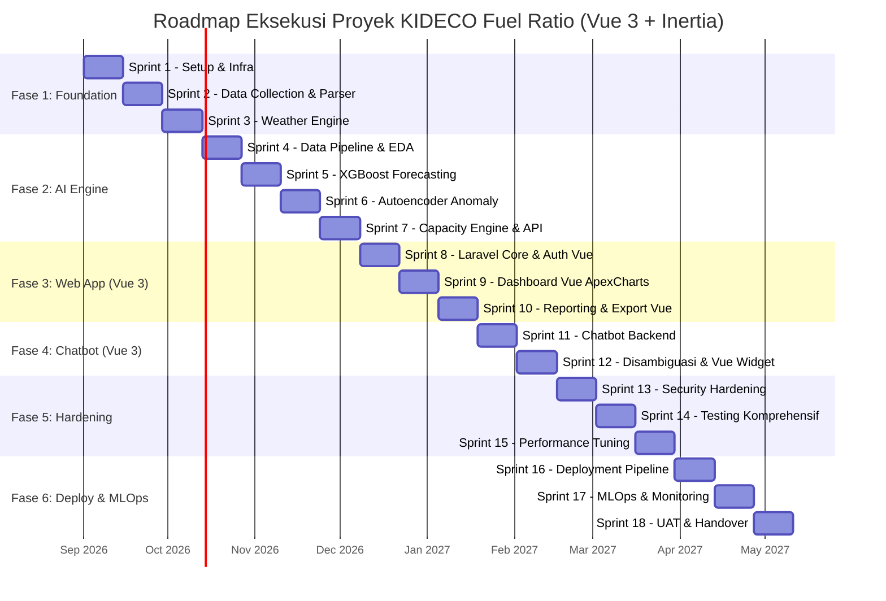

# Implementation Plan — KIDECO Fuel Ratio Integrated System

## Eksekusi Proyek Terdekomposisi: 6 Fase, 18 Sprint (Frontend: Vue 3 + Inertia.js)

> **Durasi Sprint:** 2 minggu (10 hari kerja)  
> **Total Estimasi:** ~36 minggu (9 bulan)  
> **Tech Stack Frontend:** Vue 3 (Composition API / `<script setup>`), Inertia.js Vue 3, Tailwind CSS, Vue ApexCharts (`vue3-apexcharts`), Lucide Vue Next

---

## Peta Fase & Sprint

---

## Ringkasan Pemetaan Solusi Celah → Sprint

| Celah | Severity | Sprint Penanganan | Sub-Proyek |
|:------|:---------|:------------------|:-----------|
| #1 Data sintetis → riil | 🔴 Kritis | Sprint 2, 4 | `laravel-web-portal`, `python-ai-service` |
| #2 SQL Injection chatbot | 🔴 Kritis | Sprint 11, 13 | `laravel-web-portal`, `infra-mlops-devops` |
| #3 Retraining & model drift | 🔴 Kritis | Sprint 17 | `python-ai-service`, `infra-mlops-devops` |
| #4 Autoencoder data terpolusi | 🟠 Signifikan | Sprint 6 | `python-ai-service` |
| #5 Threshold anomali statis | 🟠 Signifikan | Sprint 6 | `python-ai-service` |
| #6 XGBoost split tidak realistis | 🟠 Signifikan | Sprint 5 | `python-ai-service` |
| #7 Error handling & fallback | 🟠 Signifikan | Sprint 3, 7, 12 | `laravel-web-portal`, `python-ai-service` |
| #8 Disambiguasi sederhana | 🟠 Signifikan | Sprint 12 | `laravel-web-portal`, `frontend-vue` |
| #9 Formula derating inkonsisten | 🟡 Minor | Sprint 3 | `laravel-web-portal` |
| #10 Excel parser fragile | 🟡 Minor | Sprint 2 | `laravel-web-portal` |
| #11 Tidak ada testing | 🟡 Minor | Sprint 14 | Semua Sub-Proyek |
| #12 RBAC tidak didefinisikan | 🟡 Minor | Sprint 8 | `laravel-web-portal`, `frontend-vue` |
| #13 Fitur angin hilang | 🟡 Minor | Sprint 4 | `python-ai-service` |

---

> [!NOTE]
> Seluruh panduan per sub-proyek dapat diakses di file berikut:
> - `laravel-web-portal/sprints.md`
> - `python-ai-service/sprints.md`
> - `frontend-vue/sprints.md`
> - `infra-mlops-devops/sprints.md`
